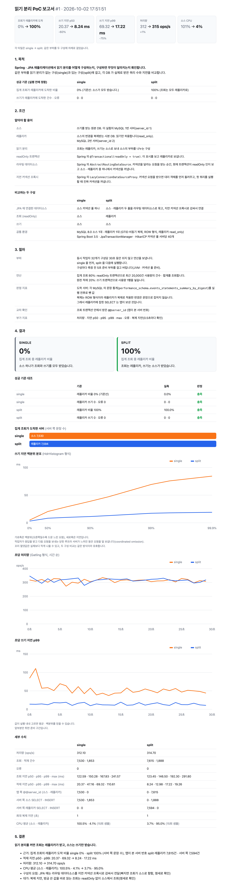
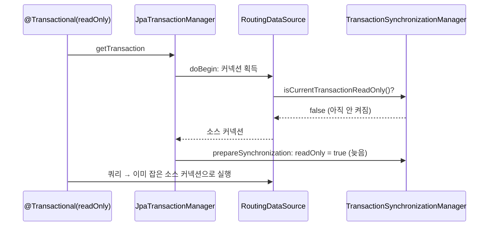
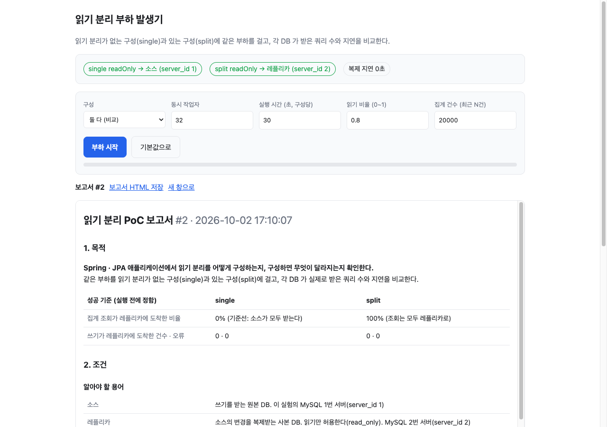

# spring-read-write-splitting-lab

Spring · JPA 애플리케이션에서 읽기 분리(조회는 레플리카, 쓰기는 소스)를 구성하고, 구성하면 무엇이 달라지는지 측정한 랩입니다.

## 요약

| 항목 | 내용 |
|---|---|
| **판정** | 됩니다.<br>단 라우팅 데이터소스를 지연 커넥션 프록시로 감싸서 JPA 에 넘겨야 합니다. |
| **수치** | 같은 부하에서 쓰기 지연 p99 가 약 4분의 1로 줄었습니다(3회 모두, 대표 69.32 → 17.22 ms).<br>집계 조회는 100% 레플리카에 도착했습니다. |
| **한계** | 레플리카 1대는 조회 처리량을 늘리지 않습니다(312 → 315 ops/s).<br>얻는 것은 소스의 여유입니다.<br>방금 쓴 값을 읽는 조회는 복제 지연 때문에 소스로 보내야 합니다. |

## 1. 목적

**조회가 몰리는 서비스에서 읽기를 레플리카로 나누려면 무엇을 구성하고, 어떻게 확인하는지 정리합니다.**

- 읽기 분리 없는 구성(single)과 있는 구성(split)에 같은 부하를 걸어 차이 측정
- 구성 단계마다 그 설정이 필요한 이유를 명세(테스트)로 기록

**성공 기준 (실행 전에 정함)**

| 조건 | 집계 조회가 레플리카에 도착한 비율 | 쓰기가 레플리카에 도착한 건수 | 오류 |
|---|---|---|---|
| single | 0% (기준선) | 0 | 0 |
| split | 100% | 0 | 0 |

## 2. 조건

### 알아야 할 용어

| 용어 | 뜻 |
|---|---|
| 소스 | 쓰기를 받는 원본 DB. 이 실험의 MySQL 1번 서버(`server_id 1`) |
| 레플리카 | 소스의 변경을 복제받는 사본 DB. 읽기만 허용합니다(`read_only`).<br>MySQL 2번 서버(`server_id 2`) |
| 읽기 분리 | 조회는 레플리카, 쓰기는 소스로 보내 소스의 부하를 나누는 구성 |
| readOnly 트랜잭션 | Spring 의 `@Transactional(readOnly = true)`. 이 표시를 보고 레플리카로 보냅니다. |
| 라우팅 데이터소스 | Spring 의 `AbstractRoutingDataSource`. DB 커넥션 요청을 받는 순간 현재 트랜잭션이 readOnly 인지 보고 소스 · 레플리카 중 하나에서 커넥션을 꺼냅니다. |
| 지연 커넥션 프록시 | Spring 의 `LazyConnectionDataSourceProxy`. 커넥션 요청에 대리 객체를 먼저 돌려주고, 첫 쿼리를 실행할 때 진짜 커넥션을 꺼냅니다. |

### 구성 순서

읽기 분리는 세 부품으로 이루어집니다.

| 순서 | 부품 | 코드 |
|---|---|---|
| ① | 소스 · 레플리카 커넥션 풀을 각각 만들고, 라우팅 데이터소스로 묶습니다.<br>고르는 규칙은 「readOnly 면 레플리카」입니다. | `ReplicaRoutingDataSource` · `RoutingStacks.routing` |
| ② | ①을 지연 커넥션 프록시로 감싸서 JPA(EntityManagerFactory)에 넘깁니다. | `RoutingStacks.splitDataSource` |
| ③ | 조회 메서드에 `readOnly = true` 를 붙입니다. | `SplitUsageOps` |

```java
@Bean
DataSource splitDataSource(LabDbProperties p) {
  return new LazyConnectionDataSourceProxy(routing(p, "sample_split"));
}
```

②가 왜 필요한지는 4장 「지연 커넥션 프록시가 필요한 이유」에서 다룹니다.

### 비교하는 두 구성

| | single | split |
|---|---|---|
| JPA 에 연결한 데이터소스 | 소스 커넥션 풀 하나 | 위 ①②③ |
| 조회 (readOnly) | 소스 | 레플리카 |
| 쓰기 | 소스 | 소스 |
| 스키마 | `sample_single` | `sample_split` |

**공통 환경**

| 항목 | 값 |
|---|---|
| DB | MySQL 8.0.44 소스 1 · 레플리카 1 (docker compose). GTID 비동기 복제, `binlog_format=ROW`, 레플리카 `read_only=ON` |
| CPU | Docker VM 2코어. 서버마다 1코어씩 고정(`cpuset`)해 별도 장비처럼 둡니다.<br>같은 코어를 나눠 쓰면 조회를 넘겨도 부하가 그대로 남습니다. |
| 데이터 | 스키마마다 사용량 200,000행을 미리 채웁니다. |
| 앱 | Spring Boot 3.5.9 · Java 17 · Hibernate 6 · `JpaTransactionManager` · HikariCP 서버당 40 (작업자 수보다 크게 둬 풀 대기가 섞이지 않게) |
| 드라이버 | `mysql-connector-java 8.0.27` |
| 머신 | 단일 노트북 |

## 3. 절차

### 부하 시나리오

| 항목 | 기본값 | 화면에서 조절 |
|---|---|---|
| 동시 작업자 | 32 | 1~256 |
| 실행 시간 | 구성당 30초, single → split 순서. 구성마다 측정 전 5초 준비 부하를 걸고 버립니다. | 3~300초 |
| 연산 비율 | 집계 조회 80% · 원천 적재 20% | 읽기 비율 0~1 |
| 집계 조회 | readOnly 트랜잭션. 최근 20,000건의 `COUNT` · `SUM` | 집계 건수 1~200,000 |
| 원천 적재 | 쓰기 트랜잭션. 사용량 한 행 `INSERT` | |

준비 부하를 두는 이유는 먼저 실행되는 구성만 JVM · 커넥션 풀 준비 비용을 떠안으면 비교가 기울기 때문입니다. 준비 없이 측정했을 때 single 의 첫 1초 쓰기 p99 가 420 ms 까지 튀었습니다.

집계 건수가 조회의 무게입니다. 기본값은 보정 실행 4회(집계 1,000 · 5,000 · 20,000건)에서 조회가 서버 1코어를 채우는 크기로 골랐습니다.

### 보는 지표

| 지표 | 어떻게 얻나 | 무엇을 판정하나 |
|---|---|---|
| **도착 서버 (서버 쪽)** | 각 MySQL `performance_schema.events_statements_summary_by_digest` 의 실행 전후 차이 | 성공 기준. 앱의 판단과 무관하게 실제로 도착한 문장 |
| 도착 서버 (앱 쪽) | 조회 트랜잭션 안에서 받은 `@@server_id` | 서버 쪽 값과 같은지 교차 확인 |
| 처리량 · 지연 p50 · p95 · p99 · max | 작업자별 측정을 실행 뒤 합산 | 분리했을 때 무엇이 달라지나 |
| 오류 · 복제 지연 | 예외 수, `SHOW REPLICA STATUS` 0.5초 샘플 | 결과를 믿을 수 있는 실행이었나 |
| 서버 CPU | 실행 스크립트가 `docker stats` 를 약 2초마다 샘플해 보고서에 넣습니다. | 조회가 어느 서버의 CPU 를 쓰는가 |
| 시간에 따른 값 | 초 단위 처리량 · 쓰기 p99 | 실행 내내 고른 값이었나 |

복제가 ROW 형식이라 레플리카가 복제로 적용한 변경은 문장으로 잡히지 않습니다. 그래서 레플리카에 잡힌 SELECT 는 앱이 보낸 것입니다.

### 자동 검증 (Spock)

부하와 별개로 구성 단계마다 같은 판정을 명세로 고정합니다.

| 층 | 명세 | 보는 것 |
|---|---|---|
| 단위 | `ReplicaRoutingDataSourceSpec` | 읽기 전용 표시에 따라 키를 고르는 규칙 |
| 단위 | `StackResultSpec` · `LoadParamsSpec` | 보고서 판정 · 부하 설정 경계 |
| 통합 | `ReadRoutingIntegrationSpec` | Testcontainers 로 MySQL 두 대를 띄워 쿼리가 도착한 서버. 지연 프록시를 뺀 구성(`WithoutLazyProxyStack`)도 여기서만 띄웁니다. |
| 통합 | `ReplicationLagSpec` | 복제를 붙이고 레플리카를 3초 늦춰(`SOURCE_DELAY`) 쓰자마자 읽을 때 무엇이 보이는지 |

**검출력 확인:** split 에서 지연 프록시 한 줄을 빼고 실행해 명세가 실패하는지 확인합니다.

## 4. 결과



원본 보고서 [docs/report.html](docs/report.html) 와 테스트 보고서 [docs/test-report/index.html](docs/test-report/index.html) 는 로컬에서 엽니다.

### 읽기 분리의 효과

대표 실행(3회 중 2회차, [docs/report.html](docs/report.html))

| 지표 | single | split |
|---|---|---|
| **집계 조회 도착 (소스 · 레플리카)** | **7,530 · 0 → 레플리카 0%** | **0 · 7,594 → 레플리카 100%** |
| 적재 도착 (소스 · 레플리카) | 1,853 · 0 | 1,888 · 0 |
| 앱 쪽 `@@server_id` (소스 · 레플리카) | 7,530 · 0 | 0 · 7,615 |
| 처리량 | 312.1 ops/s | 314.7 ops/s |
| 조회 지연 p50 · p99 | 122.59 · 167.83 ms | 123.45 · 192.30 ms |
| **적재 지연 p50 · p99** | **20.37 · 69.32 ms** | **8.24 · 17.22 ms** |
| 오류 · 최대 복제 지연 | 0 · 1초 | 0 · 1초 |
| CPU 평균 (소스 · 레플리카) | 100.5% · 4.1% | 3.7% · 95.0% |

같은 조건 3회 (구성당 30초, 준비 5초)

| 실행 | 적재 지연 p50 (ms) | 적재 지연 p99 (ms) | 처리량 (ops/s) | 소스 CPU (single → split) |
|---|---|---|---|---|
| 1 | 9.35 → 7.54 | 57.47 → 15.09 | 276 → 327 | 93.7% → 3.9% |
| 2 | 20.37 → 8.24 | 69.32 → 17.22 | 312 → 315 | 100.5% → 3.7% |
| 3 | 21.06 → 6.24 | 70.99 → 16.07 | 315 → 315 | 100.2% → 3.6% |

| 구분 | 내용 |
|---|---|
| **성공 기준 충족** | 3회 모두 single 레플리카 0%, split 레플리카 100% · 레플리카 쓰기 0 · 오류 0 |
| **관찰** | split 은 소스가 쓰기만 받아 적재 지연 p99 가 3회 모두 약 4분의 1로 줄었습니다.<br>p50 은 1회차만 차이가 작았습니다.<br>1회차는 single 의 소스 CPU 가 93.7% · 처리량 276 으로 부하가 덜 걸린 실행이었습니다.<br>조회 지연과 처리량은 거의 같습니다.<br>조회를 받는 서버가 바뀌었을 뿐 두 구성 모두 조회를 받는 서버의 1코어가 가득 찼습니다. |
| **명세** | 28건 통과. 지연 프록시를 빼면 통합 명세 3건이 실패하고 단위 명세는 통과합니다. |
| **앱 쪽 · 서버 쪽 불일치** | split 실행 8회 중 3회에서 레플리카의 서버 쪽 SELECT 가 앱 쪽보다 5 · 14 · 21건(0.1~0.3%) 적게 잡혔습니다.<br>대표 실행도 그중 하나입니다(7,615 · 7,594).<br>`Performance_schema_*_lost` 는 모두 0 입니다.<br>원인은 확인하지 못했습니다.<br>소스 도착은 양쪽 모두 0 이라 비율 판정은 바뀌지 않습니다. |
| **미수행** | 레플리카 2대 이상 분산 · 레플리카 장애 시 소스 대체는 다루지 않았습니다.<br>`DataSourceTransactionManager` · 다른 풀 구현은 확인하지 않았습니다. |

### 지연 커넥션 프록시가 필요한 이유

①과 ③만 하고 ②를 빼면 조회는 계속 소스로 갑니다. 오류는 나지 않습니다.

라우팅 데이터소스는 **커넥션을 얻는 순간 한 번** 소스 · 레플리카를 고릅니다. 그런데 `JpaTransactionManager` 는 readOnly 표시를 켜기 **전에** 커넥션부터 얻습니다.



지연 커넥션 프록시는 대리 객체를 먼저 돌려주고 첫 쿼리 때 진짜 커넥션을 얻습니다. 그때는 readOnly 표시가 켜져 있어 레플리카가 골라집니다.

| 명세 | 결과 |
|---|---|
| 라우팅 데이터소스를 지연 커넥션 프록시로 감싸지 않으면 읽기 전용 트랜잭션도 소스에서 조회한다 | 통과. 소스 SELECT 1 · 레플리카 0 |
| 읽기 분리 구성에서 읽기 전용 트랜잭션은 레플리카에서 조회한다 | 통과. 소스 0 · 레플리카 1 |
| 읽기 전용 표시가 켜져 있으면 레플리카를 고른다 (단위) | 프록시가 있든 없든 통과. 규칙이 불리는 시점은 단위 층에서 보이지 않습니다. |

### 복제 지연

읽기 분리를 켜면 레플리카는 소스보다 늦게 같은 상태가 됩니다.

| 명세 (레플리카 3초 지연) | 결과 |
|---|---|
| 레플리카가 늦으면 쓰자마자 읽기 전용 트랜잭션으로 조회한 행은 보이지 않는다 | 통과 |
| 쓰자마자 읽어야 하는 조회는 readOnly 를 빼면 소스가 받아 바로 보인다 | 통과 |
| 지연이 지나면 레플리카에서도 그 행이 보인다 | 통과 |

- 방금 쓴 값을 읽는 조회(쓰고 나서 결과 화면을 보여 주는 경우 등): `readOnly` 없이 소스에서 조회
- 이 랩의 부하 중 최대 복제 지연: 1초

## 5. 결론

**읽기 분리는 세 부품으로 이루어집니다. 라우팅 데이터소스, 그것을 감싼 지연 커넥션 프록시, `readOnly` 표시입니다.**

| 항목 | 내용 |
|---|---|
| 판정 | 됩니다.<br>조회는 레플리카, 쓰기는 소스로 나뉩니다. |
| 근거 | 서버 쪽 문장 수에서 split 레플리카 100% · 레플리카 쓰기 0 (3회). 앱 쪽 관찰과 같은 방향입니다.<br>통합 명세가 같은 판정을 고정합니다. |
| 얻는 것 | 소스의 여유입니다.<br>같은 부하에서 쓰기 지연 p99 가 약 4분의 1로 줄었습니다(대표 69.32 → 17.22 ms). |
| 얻지 못하는 것 | 레플리카 1대로는 조회 처리량이 늘지 않습니다.<br>늘리려면 레플리카를 더 둡니다. |
| 설정의 요점 | JPA 에는 라우팅 데이터소스를 지연 커넥션 프록시로 감싸서 넘깁니다. |
| 확인 방법 | 오류가 없다는 것은 근거가 아닙니다.<br>**쿼리가 도착한 서버를 서버 쪽에서 셉니다.** 테스트는 실제 트랜잭션 매니저 · 커넥션 풀 · DB 를 띄운 통합 층에 둡니다. |
| 대가 | 복제 지연입니다.<br>방금 쓴 값을 읽는 조회는 `readOnly` 를 빼서 소스로 보냅니다. |
| 다음 단계 | 레플리카 2대 분산과 레플리카 장애 시 소스 대체 |

---

## 부록 A. 실행

**한 번에 끝까지:** 파라미터만 정하고 실행하면 DB 기동 → 복제 대기 → 앱 기동 → 부하 · CPU 수집 → 보고서 저장 → 앱 종료 · 컨테이너 삭제까지 진행합니다. 중간에 실패해도 정리는 실행됩니다.

```bash
scripts/run-lab.sh                                   # 기본값: 작업자 32 · 30초 · 읽기 0.8 · 집계 20,000건
scripts/run-lab.sh --concurrency 64 --duration 60    # 파라미터 지정
```

- 보고서: `reports/report-<시각>.html` 에 저장, 자동으로 열림(`--no-open` 으로 끔)
- 소요 시간: 한 번에 약 2분
- 준비물: Docker(Rancher Desktop · Docker Desktop)

**화면으로 하나씩:**

```bash
docker compose up -d          # MySQL 소스(3307) · 레플리카(3308), 복제 자동 연결
./gradlew bootRun             # http://localhost:8080
./gradlew test                # Testcontainers 가 MySQL 을 직접 띄웁니다
docker compose down -v        # 끝나면 정리
```



- 「부하 시작」: 기본값 그대로 single → split 실행 후 보고서 표시
- 「보고서 HTML 저장」: 독립 파일 한 장
- Rancher Desktop: `build.gradle` 이 `~/.rd/docker.sock` 을 찾아 Testcontainers 환경 변수 설정

## 부록 B. 명세 이름

- 기준: 『Software Engineering at Google』 12장
- 이름 하나에 행위와 기대 결과를 한 문장으로
- 「그리고」가 필요하면 행동이 둘이므로 분리
- 아래 목록: 테스트 코드의 실제 이름(원문 유지)

```
읽기 분리가 없으면 읽기 전용 트랜잭션도 소스에서 조회한다
읽기 분리 구성에서 읽기 전용 트랜잭션은 레플리카에서 조회한다
읽기 분리 구성에서도 쓰기 트랜잭션은 소스에 적재한다
라우팅 데이터소스를 지연 커넥션 프록시로 감싸지 않으면 읽기 전용 트랜잭션도 소스에서 조회한다
레플리카에 직접 쓰면 읽기 전용이라 거절한다
읽기 분리가 없으면 부하 중 집계 조회는 모두 소스에 간다
부하를 걸면 읽기 분리 구성의 집계 조회는 모두 레플리카에 간다
부하 중 앱이 받은 서버 번호와 서버가 집계한 문장 수가 일치한다
레플리카가 늦으면 쓰자마자 읽기 전용 트랜잭션으로 조회한 행은 보이지 않는다
쓰자마자 읽어야 하는 조회는 readOnly 를 빼면 소스가 받아 바로 보인다
지연이 지나면 레플리카에서도 그 행이 보인다
읽기 전용 표시가 켜져 있으면 레플리카를 고른다
읽기 전용 표시가 없으면 소스를 고른다
```

## 부록 C. 구성

| 경로 | 역할 |
|---|---|
| `datasource/ReplicaRoutingDataSource` | readOnly 표시로 소스 · 레플리카를 고릅니다. |
| `datasource/RoutingStacks` | single(소스 하나) · split(라우팅 + 지연 프록시) 두 구성 |
| `usage/*UsageOps` | 집계 조회 · 원천 적재. 연산마다 응답한 `@@server_id` 를 돌려줍니다. |
| `load/ServerProbe` · `load/LoadRunner` | 서버 쪽 문장 수 · 복제 지연, 부하 실행 |
| `web/` · `static/index.html` | 부하 발생기 화면과 보고서 |
| `docker/` · `docker-compose.yml` | 소스 · 레플리카와 스키마 · 초기 데이터 · 계정 |
| `scripts/run-lab.sh` | 한 번 실행: 기동 · 부하 · CPU 수집 · 보고서 · 정리 |
| `src/test/.../WithoutLazyProxyStack` | 지연 프록시를 뺀 구성. 명세에서만 띄웁니다. |
