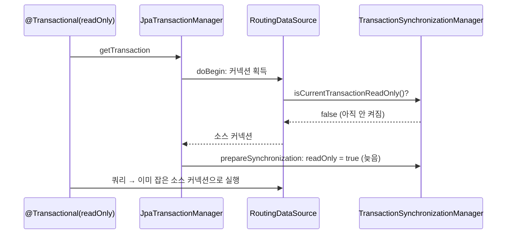

# read-replica-routing-lab

## 1. 목적

**읽기 전용 트랜잭션을 레플리카 DB 로 보내도록 만든 설정이, 실제로 쿼리를 레플리카에 도착시키는지 확인한다.**

- 설정이 틀려도 소스 DB 가 대신 응답하므로 오류가 나지 않는다
- 그래서 앱의 동작이 아니라, 각 DB 가 실제로 받은 쿼리 수로 판정한다

**성공 기준 (실행 전에 정함)**

| 조건 | 집계 조회가 레플리카에 도착한 비율 | 쓰기가 레플리카에 도착한 건수 | 오류 |
|---|---|---|---|
| broken | 0% 면 결함 재현 | 0 | 0 |
| fixed | 100% 면 해결 | 0 | 0 |

## 2. 조건

### 알아야 할 용어

| 용어 | 뜻 |
|---|---|
| 소스 | 쓰기를 받는 원본 DB. 이 실험의 MySQL 1번 서버(`server_id 1`) |
| 레플리카 | 소스의 변경을 복제받는 사본 DB. 읽기만 허용한다(`read_only`). MySQL 2번 서버(`server_id 2`) |
| 읽기 분리 | 조회는 레플리카, 쓰기는 소스로 보내 소스의 부하를 나누는 구성 |
| readOnly 트랜잭션 | Spring 의 `@Transactional(readOnly = true)`. 이 표시를 보고 레플리카로 보낸다 |
| 라우팅 데이터소스 | Spring 의 `AbstractRoutingDataSource`. DB 커넥션 요청을 받는 순간 현재 트랜잭션이 readOnly 인지 보고 소스 · 레플리카 중 하나에서 커넥션을 꺼낸다 |
| 지연 커넥션 프록시 | Spring 의 `LazyConnectionDataSourceProxy`. 커넥션 요청에 대리 객체를 먼저 돌려주고, 첫 쿼리를 실행할 때 진짜 커넥션을 꺼낸다 |

### 비교하는 두 구성

두 구성은 코드가 같다.
다른 것은 JPA(Hibernate)에 어떤 데이터소스를 연결했느냐 하나뿐이다.

| | broken | fixed |
|---|---|---|
| JPA 에 연결한 데이터소스 | 라우팅 데이터소스를 **직접** 연결 | 라우팅 데이터소스를 지연 커넥션 프록시로 **감싸서** 연결 |
| 소스 · 레플리카를 고르는 시점 | 트랜잭션이 시작될 때. 이때는 readOnly 표시가 아직 켜지지 않았다 | 첫 쿼리를 실행할 때. 이때는 readOnly 표시가 켜져 있다 |
| 기대 동작 | readOnly 트랜잭션도 소스로 간다 (결함) | readOnly 트랜잭션은 레플리카, 쓰기는 소스로 간다 |
| 스키마 | `sample_broken` | `sample_fixed` |

```diff
  @Bean
  DataSource fixedDataSource(LabDbProperties p) {
-   return routing(p, "sample_fixed");
+   return new LazyConnectionDataSourceProxy(routing(p, "sample_fixed"));
  }
```

**공통 환경**

| 항목 | 값 |
|---|---|
| DB | MySQL 8.0.44 소스 1 · 레플리카 1 (docker compose). GTID 비동기 복제, `binlog_format=ROW`, 레플리카 `read_only=ON` |
| 앱 | Spring Boot 3.5.9 · Java 17 · Hibernate 6 · `JpaTransactionManager` · HikariCP 서버당 10 |
| 드라이버 | `mysql-connector-java 8.0.27` |
| 머신 | 단일 노트북, 컨테이너 2대 |

## 3. 절차

### 부하 시나리오

| 항목 | 기본값 | 화면에서 조절 |
|---|---|---|
| 동시 작업자 | 16 | 1~256 |
| 실행 시간 | 구성당 15초, broken → fixed 순서 | 3~300초 |
| 연산 비율 | 집계 조회 80% · 원천 적재 20% | 읽기 비율 0~1 |
| 집계 조회 | readOnly 트랜잭션. 최근 10분 행의 `COUNT` · `SUM` | 집계 구간 1~1440분 |
| 원천 적재 | 쓰기 트랜잭션. 사용량 한 행 `INSERT` | |

### 보는 지표

| 지표 | 어떻게 얻나 | 무엇을 판정하나 |
|---|---|---|
| **도착 서버 (서버 쪽)** | 각 MySQL `performance_schema.events_statements_summary_by_digest` 의 실행 전후 차이 | 성공 기준. 앱의 판단과 무관하게 실제로 도착한 문장 |
| 도착 서버 (앱 쪽) | 조회 트랜잭션 안에서 받은 `@@server_id` | 서버 쪽 값과 같은지 교차 확인 |
| 처리량 · 지연 p50 · p95 · p99 · max | 작업자별 측정을 실행 뒤 합산 | 분리했을 때 무엇이 달라지나 |
| 오류 · 복제 지연 | 예외 수, `SHOW REPLICA STATUS` 1초 샘플 | 결과를 믿을 수 있는 실행이었나 |

- 복제가 ROW 형식이라 레플리카가 복제로 적용한 변경은 문장으로 잡히지 않는다
- 그래서 레플리카에 잡힌 SELECT 는 앱이 보낸 것이다

### 자동 검증 (Spock)

부하와 별개로 같은 판정을 명세로 고정한다.
층마다 잡는 결함이 다르다.

| 층 | 명세 | 보는 것 |
|---|---|---|
| 단위 | `ReplicaRoutingDataSourceSpec` | 읽기 전용 표시에 따라 키를 고르는 규칙 |
| 단위 | `StackResultSpec` · `LoadParamsSpec` | 보고서 판정 · 부하 설정 경계 |
| 통합 | `ReadRoutingIntegrationSpec` | Testcontainers 로 MySQL 두 대를 띄워 쿼리가 도착한 서버. 복제는 붙이지 않는다(결과가 복제 지연에 흔들리지 않게) |

**검출력 확인:** fixed 에서 지연 프록시 한 줄을 빼고 돌려 명세가 실패하는지 본다.

## 4. 결과


원본 보고서 [docs/report.html](docs/report.html) · 테스트 보고서 [docs/test-report/index.html](docs/test-report/index.html) (로컬에서 연다)

| 지표 | broken | fixed |
|---|---|---|
| **집계 조회 도착 (소스 · 레플리카)** | **6,279 · 0 → 레플리카 0%** | **0 · 6,716 → 레플리카 100%** |
| 적재 도착 (소스 · 레플리카) | 1,528 · 0 | 1,627 · 0 |
| 앱 쪽 `@@server_id` (소스 · 레플리카) | 6,279 · 0 | 0 · 6,716 |
| 처리량 | 509.9 ops/s | 544.7 ops/s |
| 조회 지연 p50 · p99 | 29.38 · 92.16 ms | 32.54 · 80.72 ms |
| 적재 지연 p50 · p99 | 18.43 · 75.89 ms | **4.69 · 10.80 ms** |
| 오류 · 최대 복제 지연 | 0 · 1초 | 0 · 1초 |

| 구분 | 내용 |
|---|---|
| **성공 기준 충족** | broken 레플리카 0% (결함 재현), fixed 레플리카 100% · 레플리카 쓰기 0 · 오류 0. 서버 쪽과 앱 쪽 수치가 일치 |
| **관찰** | fixed 는 소스가 쓰기만 받아 적재 지연 p50 이 18.43 → 4.69 ms 로 줄었다. 조회 지연은 두 구성이 비슷하다. 읽기를 받는 서버가 바뀌었을 뿐 한 대가 받는 양은 같기 때문이다 |
| **명세** | 23건 통과. 지연 프록시를 빼면 통합 명세 2건이 실패하고 단위 명세는 통과한다. 이 결함은 단위 층에서 잡히지 않는다 |
| **미수행** | 실제 서비스 앱을 직접 계측하지 않았다(같은 구성을 옮긴 재현). `DataSourceTransactionManager` · 다른 풀 구현은 확인하지 않았다. 복제 지연이 커질 때 조회 정합성은 측정하지 않았다 |

### 해석: 왜 소스로 가나

- 라우팅 데이터소스는 **커넥션을 얻는 순간 한 번** 소스 · 레플리카를 고른다
- 그런데 트랜잭션 매니저는 readOnly 표시를 켜기 **전에** 커넥션부터 얻는다



- 지연 커넥션 프록시는 대리 객체를 먼저 돌려주고 첫 쿼리 때 진짜 커넥션을 얻는다
- 그때는 readOnly 표시가 켜져 있어 레플리카가 골라진다

## 5. 결론

**라우팅 데이터소스를 JPA 에 직접 연결하면 읽기 분리는 동작하지 않는다.**
**지연 커넥션 프록시(`LazyConnectionDataSourceProxy`)로 감싸서 연결해야 동작한다.**

| 항목 | 내용 |
|---|---|
| 판정 | broken 은 동작하지 않는다. fixed 로 고친다 |
| 근거 | 서버 쪽 문장 수에서 broken 레플리카 0% · fixed 100%. 앱 쪽 관찰과 일치. 통합 명세가 같은 판정을 고정 |
| 확인 방법의 교훈 | 오류가 없다는 것은 근거가 아니다. **쿼리가 도착한 서버를 서버 쪽에서 센다.** 테스트는 실제 트랜잭션 매니저 · 커넥션 풀 · DB 를 띄운 통합 층에 둔다 |
| 제약 | 고치면 복제 지연이 새 문제로 들어온다. 방금 쓴 값을 바로 읽는 조회는 레플리카로 보내지 않는다 |
| 다음 단계 | 복제 지연을 인위로 늘렸을 때 집계 정합성 측정. `DataSourceTransactionManager` 에서도 같은 결함이 나는지 확인 |

---

## 부록 A. 실행

```bash
docker compose up -d          # MySQL 소스(3307) · 레플리카(3308), 복제 자동 연결
./gradlew bootRun             # http://localhost:8080
./gradlew test                # Testcontainers 가 MySQL 두 대를 직접 띄운다
```


- 기본값이 채워져 있어 「부하 시작」 한 번이면 broken → fixed 순으로 실행하고 보고서를 띄운다
- 「보고서 HTML 저장」은 독립 파일 한 장을 만든다
- Rancher Desktop 은 `build.gradle` 이 `~/.rd/docker.sock` 을 찾아 Testcontainers 환경 변수를 넣는다

## 부록 B. 명세 이름

- 『Software Engineering at Google』 12장 기준을 따랐다
- 이름은 행위와 기대 결과를 한 문장으로 담는다
- 「그리고」가 필요하면 행동이 둘이라 나눈다

```
고치기 전 구성은 읽기 전용 트랜잭션이어도 소스에서 조회한다
커넥션을 첫 쿼리 때 얻도록 감싸면 읽기 전용 트랜잭션은 레플리카에서 조회한다
감싼 구성에서도 쓰기 트랜잭션은 소스에 적재한다
레플리카에 직접 쓰면 읽기 전용이라 거절한다
부하를 걸어도 고치기 전 구성의 집계 조회는 레플리카에 하나도 가지 않는다
부하를 걸면 감싼 구성의 집계 조회는 모두 레플리카에 간다
부하 중 앱이 받은 서버 번호와 서버가 집계한 문장 수가 일치한다
읽기 전용 표시가 켜져 있으면 레플리카를 고른다
읽기 전용 표시가 없으면 소스를 고른다
```

## 부록 C. 구성

| 경로 | 역할 |
|---|---|
| `datasource/ReplicaRoutingDataSource` | readOnly 표시로 소스 · 레플리카를 고른다 |
| `datasource/RoutingStacks` | 같은 라우팅을 두 벌. 차이는 지연 프록시 한 줄 |
| `usage/*UsageOps` | 집계 조회 · 원천 적재. 연산마다 응답한 `@@server_id` 를 돌려준다 |
| `load/ServerProbe` · `load/LoadRunner` | 서버 쪽 문장 수 · 복제 지연, 부하 실행 |
| `web/` · `static/index.html` | 부하 발생기 화면과 보고서 |
| `docker/` · `docker-compose.yml` | 소스 · 레플리카와 스키마 · 계정 |
